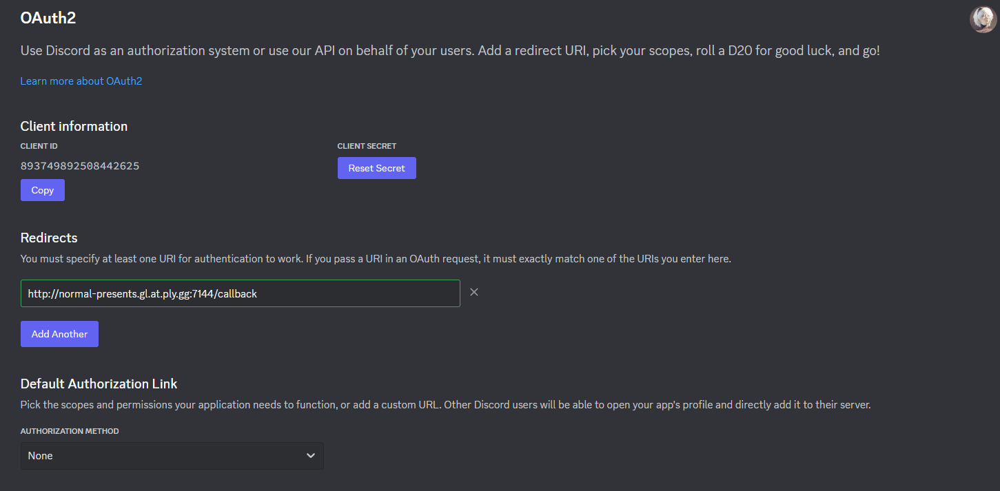
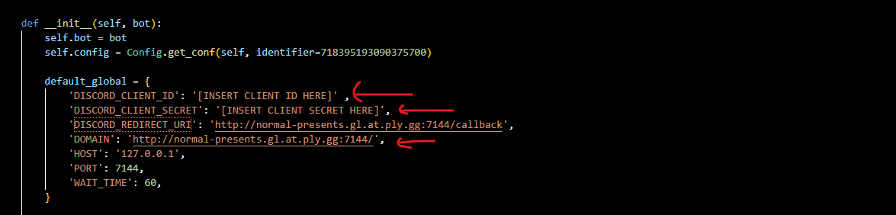

You do need to edit some config values (using the [p]set[INSER COMMAND NAME HERE])   before you can use it.

Also you need to set the redirect URL in the discord developer portal for your app (https://discord.com/developers/applications)



you need to set these values, marked with the red arrow using the commands:
```
[p]setclientid 19928280981809
[p]setclientsecret idgjijfgdhnjghndfiuhgd
[p]setdomain http://hypixel.com
```




Ofcourse the other settings are also configurable but these are the bare minimum, then you'll have a webserver running at https://127.0.0.1:7144